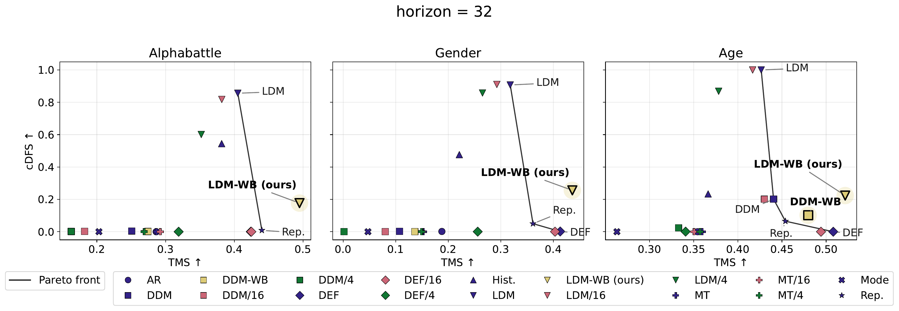

# Realism VS Accuracy: Event Sequence Forecasting from a Generative Modeling Perspective

Official code for the NeurIPS 2026 paper (Evaluations & Datasets Track).

<table>
  <tr>
    <td align="center">
      
      <br>
      <sub><b>Accuracy (TMS) vs. realism (cDFS)</b> on three datasets at horizon 32. The solid line is the Pareto front over baselines: no method is strong on both axes, while LDM-WB (ours) moves the front.</sub>
    </td>
  </tr>
</table>

We study multi-horizon forecasting of event sequences with heterogeneous (numerical and categorical) features as a conditional generative modeling problem, and evaluate forecasts not only for prediction accuracy but also for distributional realism. The benchmark comprises metrics for both aspects, strong statistical baselines, recent generative models adapted from adjacent fields, and curated real-world datasets. Each axis has a headline score and finer-grained metrics:
- **Prediction accuracy**: the Temporal Matching Score (**TMS**) aggregates all features at once; matched and paired per-feature submetrics (R1 for time and amounts, F1 for categories) show where the error comes from.
- **Distributional realism**: the Conditional Detection Fooling Score (**cDFS**) trains a history-aware discriminator; the discriminator-free Shape and Trend scores give a graded signal where cDFS saturates.

Our evaluation shows that **no method excels at both accuracy and realism**. We also introduce **Wasserstein BaryBooster**, which aggregates samples from a realism-strong diffusion model into a state-of-the-art predictor, showing that distributional realism can be converted into prediction accuracy.

---

### Model names

| Paper | Code (`configs_paper/methods/`, `log/gen-paper/<dataset>/horizon_<H>/`) |
|---|---|
| Hist., Mode, Repeat | `baselines/hist_sampler`, `baselines/mode`, `baselines/repeat` |
| AR | `ar` |
| MT | `multitoken` |
| LDM | `ldm/vae` |
| DDM | `cdiff` |
| DEF | `detpp` |
| LDM-WB | `ldm/vae/booster/wasserstein_barybooster1` |

### Metric names

Metric names as they appear in `results.csv` (`<amount>`, `<time>`, `<category>` are dataset column names):

| Axis | Metric | Name in `results.csv` |
|---|---|---|
| Accuracy | TMS | `GenOTD` |
| | Matched per-feature submetrics | `Matched R1 <amount>`, `Matched <time>`, `Matched F1 <category>` |
| | Paired per-feature submetrics (no permutation) | `Paired R1 <amount>`, `Paired <time>`, `Paired F1 <category>` |
| Realism | cDFS | `Detection score (<L> hist) mean` |
| | Shape, Trend | `Density shape`, `Density trend` |
| | Category cardinality | `Cardinality on <category> gen` |

The full metric set per dataset is defined in `configs_paper/metrics/with_detection/<dataset>.yaml`.

## Setup

Install dependencies:

```bash
pip install -r requirements.txt
pip install --no-build-isolation torch-linear-assignment
```

## Docker Recommendation

For reproducible runs across machines, we recommend using the repository `Dockerfile`.

```bash
docker build -t trx_gen .
docker run --gpus all --rm -it -v $(pwd):/workspace -w /workspace trx_gen bash
```

## Datasets

Datasets are handled by preprocessing scripts. If raw files are missing, scripts automatically download required assets from public sources.

Benchmark datasets:
- `gender`
- `alphabattle`
- `age`

## Data Preparation

Run preprocessing scripts before training/evaluation:

```bash
python generation/data/preprocess/gender.py
python generation/data/preprocess/alpha_battle.py
python generation/data/preprocess/age.py
```

Preprocessed data is stored under `data/`.

### Additional TPP corpora (transfer appendix only)

`retweet` and `amazon` are EasyTPP corpora from Hugging Face. They are not part of the benchmark and are used only for the transfer experiment in the appendix.

```bash
python generation/data/preprocess/retweet.py
python generation/data/preprocess/amazon.py
```

## Run Experiment

```bash
python main.py --config_path <path/to/experiment/config> --run_name <run_name_in_logs>
```

Example:

```bash
python main.py --config_path scripts/experiments/age/horizon_32/detpp.yaml --run_name horizon_32/detpp
```

Run from the repository root: config and checkpoint paths are relative to it.

## Full Experiment Guide (paper pipeline)

`scripts/experiments/` contains exact training config files used for runs.

### 0) Baselines

Statistical baselines need no training; run them for all horizons of a dataset:

```bash
./scripts/run_baselines.sh age cuda:0
```

### 1) Learning-rate sweep

Run LR sweep for a target config:

Example:

```bash
./scripts/grid_lr.sh scripts/experiments/age/horizon_64/detpp.yaml cuda:0
```

This creates runs under `log/gen-paper/<dataset>/<exp>/lr/<lr_value>/`.

### 2) Select best LR with notebook tools

Use notebook utilities from `notebooks/exp_analisis/utils.py` to inspect sweep status/metrics and save final picks.

Minimal usage in notebook:

```python
from notebooks.exp_analisis.utils import ExpNavigator, ExpChecker

# Interactive sweep browser
ExpNavigator("log/gen-paper/age").run()

# Status table + suggested commands for missing runs
checker = ExpChecker("age")
checker.summary_notebook()
checker.suggest_commands(device="cuda:0")
```

Important for LDM:
- before running/evaluating `ldm/vae`, set `model.autoencoder.checkpoint` to the selected VAE checkpoint.
- this is defined in experiment YAMLs (for example in `scripts/experiments/.../ldm/vae.yaml`).

### 3) Sweep CFG / temperature after best LR selection

For diffusion models (`ldm/vae`, `cdiff`), run CFG sweep:

```bash
python scripts/grid_cfg.py log/gen-paper/<dataset>/horizon_<H>/<model> cuda:0
```

Examples:

```bash
python scripts/grid_cfg.py log/gen-paper/age/horizon_64/ldm/vae cuda:0
python scripts/grid_cfg.py log/gen-paper/age/horizon_64/cdiff cuda:0
```

For autoregressive-style models (`ar`, `multitoken`, `detpp`), run temperature sweep:

```bash
python scripts/grid_temp.py log/gen-paper/<dataset> --model <model> --device cuda:0 --horizon <H>
```

Examples:

```bash
python scripts/grid_temp.py log/gen-paper/age --model ar --device cuda:0 --horizon 64
python scripts/grid_temp.py log/gen-paper/age --model multitoken --device cuda:0 --horizon 64
python scripts/grid_temp.py log/gen-paper/age --model detpp --device cuda:0 --horizon 64
```

Then return to notebook tools to select/store final runs.

### 4) Booster and cross-horizon experiments

After final model selection:

```bash
python scripts/grid_booster.py log/gen-paper/<dataset> --device cuda:0
python scripts/grid_cross_horizon.py log/gen-paper/<dataset> --model <model> --device cuda:0
```

Examples:

```bash
python scripts/grid_booster.py log/gen-paper/age --device cuda:0
python scripts/grid_cross_horizon.py log/gen-paper/age --model ldm/vae --device cuda:0
python scripts/grid_cross_horizon.py log/gen-paper/age --model detpp --device cuda:0
python scripts/grid_cross_horizon.py log/gen-paper/age --model multitoken --device cuda:0
python scripts/grid_cross_horizon.py log/gen-paper/age --model cdiff --device cuda:0
```

### 5) Ablations

Scripts in `scripts/ablations/` reproduce the ablation tables from the paper appendix; results land under `log/ablations/`.

```bash
# Inference-time measurement (runtime appendix): full test split, one job per GPU
python scripts/ablations/eval_time.py run --dataset age,gender,alphabattle --device cuda:0
python scripts/ablations/eval_time.py collect

# BaryBooster: TMS/cDFS vs sample count N, and wall-time profiling (sampling vs matching)
python scripts/ablations/booster_profile.py sweep --dataset age --device cuda:0
python scripts/ablations/booster_profile.py time  --dataset age --device cuda:0
python scripts/ablations/booster_profile.py collect --dataset age,gender,alphabattle

# cDFS discriminator ablation (detector architectures/capacities) + collection
python scripts/ablations/detector_ablation.py --dataset age --device cuda:0
python scripts/ablations/detector_collect.py --dataset age
```

## License

Source code is licensed under CC BY-NC-SA 4.0 (see `LICENSE`).

### Third-party code

Parts of the code are adapted from the following projects, under their own licenses:

| Code in this repository | Source | License |
|---|---|---|
| `generation/models/encoders/gpt.py` (AR, MT) | [nanoGPT](https://github.com/karpathy/nanoGPT) | MIT |
| DEF (`generation/models/generator/detpp.py`, `generation/losses/detpp/`) | [HoTPP benchmark](https://github.com/ivan-chai/hotpp-benchmark) | Apache-2.0 |
| `generation/models/encoders/ldm/adiff4tpp/`, `generation/models/encoders/ldm/networks/DiT.py` | [ADiff4TPP](https://github.com/BorealisAI/adiff4tpp), [DiT](https://github.com/facebookresearch/DiT) | CC BY-NC-SA 4.0, CC BY-NC 4.0 |
| `generation/models/encoders/ldm/tabsyn/` | [TabSyn](https://github.com/amazon-science/tabsyn) | Apache-2.0 |
| `generation/models/encoders/ldm/dbim/karras_diffusion.py` | [k-diffusion](https://github.com/crowsonkb/k-diffusion) | MIT |
| `generation/models/generator/cdiffu/type_diffusion_model.py` | [denoising-diffusion-pytorch](https://github.com/lucidrains/denoising-diffusion-pytorch) | MIT |
